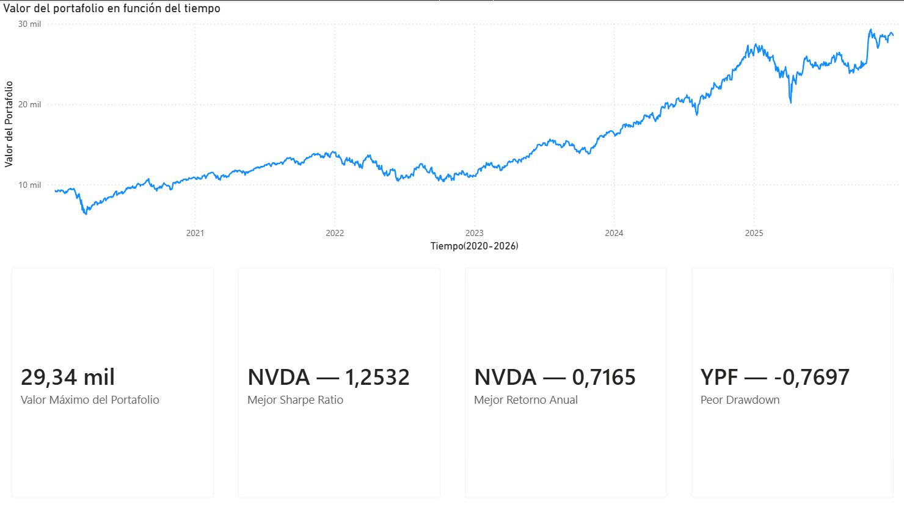
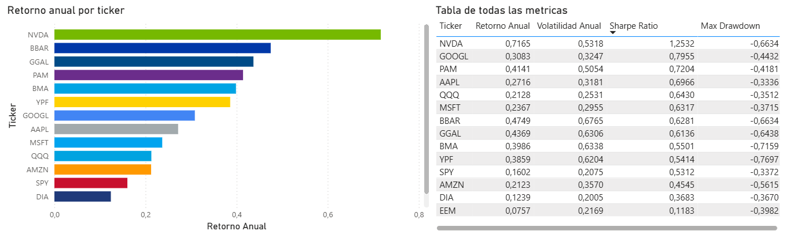
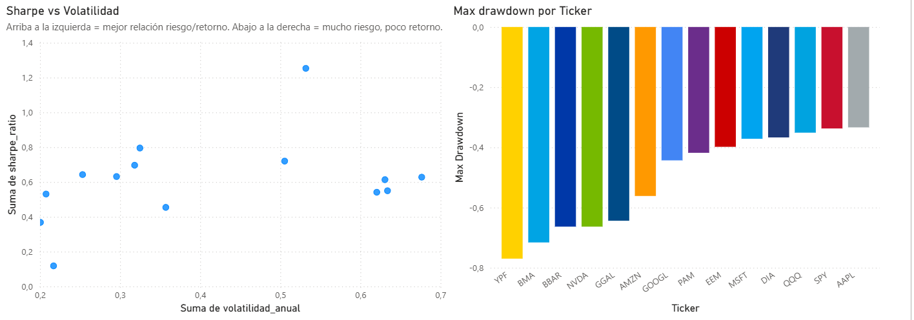
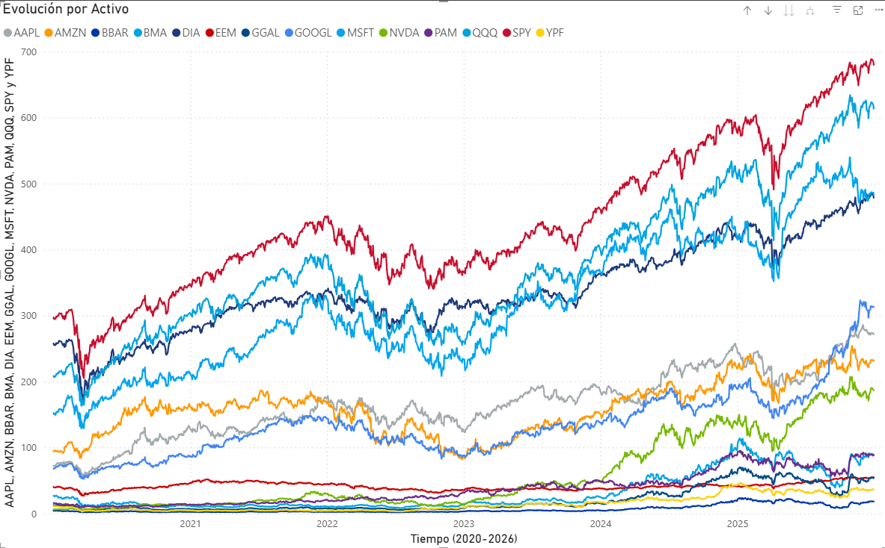

# Tablero de Control de Inversiones y Activos Financieros

> Proyecto de análisis de datos para portfolio personal. Integra Python, SQL y Power BI para construir un dashboard interactivo de seguimiento y análisis de riesgo de inversiones.

---

## 📌 Descripción

Este proyecto automatiza el seguimiento de un portafolio de 14 activos financieros (ETFs americanos y acciones de EE.UU. y Argentina) desde la descarga de datos históricos hasta la visualización interactiva en Power BI. Incluye cálculo de métricas de riesgo estándar de la industria: retorno anual, volatilidad, Sharpe Ratio y Maximum Drawdown.

Es mi primer proyecto autodidacta en análisis de datos, desarrollado mientras curso la Diplomatura en Gestión y Análisis de Datos de la UBA y la carrera de Programación.

---

## 🗂️ Estructura del proyecto

```
├── data/               # Datos crudos y procesados (.csv)
├── notebooks/          # Jupyter Notebooks (ETL y EDA)
├── scr/                # Scripts Python del pipeline
│   ├── 01_descarga_de_datos.py
│   ├── 02_notebook_etl.py
│   ├── 03_transform.py
│   └── 04_load.py
├── sql/                # Schema y queries analíticas
├── powerbi/            # Archivo .pbix del dashboard
├── img/                # Capturas del dashboard
└── README.md
```

---

## 🛠️ Stack utilizado

| Herramienta | Uso |
|---|---|
| Python (Pandas, NumPy) | Extracción, limpieza y cálculo de métricas de riesgo |
| yfinance | API para descarga de precios históricos |
| SQL (PostgreSQL) | Almacenamiento estructurado y consultas analíticas |
| SQLAlchemy | Conexión entre Python y PostgreSQL |
| Power BI | Dashboard interactivo final |

---

## ⚙️ Pipeline de datos

El proyecto corre en 4 scripts secuenciales:

### `01_descarga_de_datos.py`
Conecta a la API de yfinance y descarga los precios históricos de los 14 activos. Construye la tabla del portafolio con la composición de activos y genera la tabla de referencia con la categoría de cada ticker (ETF, acción USA, acción ARG). Guarda todo en archivos CSV en la carpeta `/data`.

### `02_notebook_etl.py`
Limpieza y normalización de los datos crudos. Maneja valores faltantes, verifica consistencia de fechas y genera el archivo `precios_limpios.csv` listo para el análisis.

### `03_transform.py`
Calcula las métricas de riesgo a partir de los precios limpios:
- **Retornos diarios** con `pct_change()`
- **Retorno anual** (retorno diario promedio × 252 días hábiles)
- **Volatilidad anual** (desvío estándar × √252)
- **Sharpe Ratio** (retorno ajustado por riesgo, usando tasa libre de riesgo del 5%)
- **Maximum Drawdown** (máxima caída desde el pico histórico)

Guarda los resultados en `metricas_riesgo.csv`.

### `04_load.py`
Carga todas las tablas CSV a PostgreSQL usando SQLAlchemy. Reemplaza las tablas existentes en cada ejecución para mantener los datos actualizados.

Para actualizar el dashboard completo, correr los scripts en orden:
```bash
python scr/01_descarga_de_datos.py
python scr/02_notebook_etl.py
python scr/03_transform.py
python scr/04_load.py
```

---

## 📊 Dashboard — Power BI

El dashboard está dividido en 4 páginas:

### Página 1 — Resumen del portafolio
Vista general del portafolio. Muestra el valor total, el activo con mejor Sharpe Ratio, el de mayor retorno anual y el de peor drawdown. Pensada para una lectura rápida del estado del portafolio.

> 📷 

### Página 2 — Análisis por activo
Comparación entre activos. Incluye un gráfico de barras con el retorno anual por ticker, una tabla completa con todas las métricas y un segmentador para filtrar por categoría (ETFs, acciones USA, acciones ARG).

> 📷 

### Página 3 — Análisis de riesgo
Visualización de la relación riesgo/retorno. El gráfico de dispersión Sharpe vs Volatilidad permite identificar los activos más eficientes: los que están arriba a la izquierda tienen buen retorno ajustado al riesgo con baja volatilidad. Los que están abajo a la derecha toman mucho riesgo con poco retorno. Complementado con un gráfico de barras de Maximum Drawdown por activo.

> 📷 

### Página 4 — Evolución por activo
Gráfico de líneas con los precios históricos filtrable por ticker. Permite ver cómo evolucionó cada activo individualmente a lo largo del tiempo.

> 📷 

---

## 🚀 Cómo ejecutar el proyecto

### Requisitos
- Python 3.10+
- PostgreSQL
- Power BI Desktop

### Instalación

```bash
git clone https://github.com/tu-usuario/Proyecto-Tablero-de-Control-de-Inversiones-y-Activos-Financieros
cd Proyecto-Tablero-de-Control-de-Inversiones-y-Activos-Financieros
pip install -r requirements.txt
```

### Variables de entorno

Crear un archivo `.env` en la raíz del proyecto:

```
DB_USER=tu_usuario
DB_PASSWORD=tu_contraseña
DB_HOST=localhost
DB_PORT=5432
DB_NAME=nombre_de_tu_base
```

### Ejecutar el pipeline

```bash
python scr/01_descarga_de_datos.py
python scr/02_notebook_etl.py
python scr/03_transform.py
python scr/04_load.py
```

Luego abrir el archivo `powerbi/tablero.pbix` y actualizar los datos desde Power BI Desktop.

---

## 📈 Activos analizados

| Ticker | Tipo | Mercado |
|--------|------|---------|
| SPY | ETF | USA |
| QQQ | ETF | USA |
| DIA | ETF | USA |
| EEM | ETF | USA |
| AAPL | Acción | USA |
| MSFT | Acción | USA |
| GOOGL | Acción | USA |
| AMZN | Acción | USA |
| NVDA | Acción | USA |
| GGAL | Acción | ARG |
| YPF | Acción | ARG |
| PAM | Acción | ARG |
| BBAR | Acción | ARG |
| BMA | Acción | ARG |

---

## 🧠 Conceptos aplicados

- Extracción de datos desde APIs financieras
- ETL (Extract, Transform, Load)
- Cálculo de métricas de riesgo financiero
- Modelado de base de datos relacional
- Visualización de datos e interpretación de resultados

---

## 👤 Autor

Desarrollado por **Matias Bustamante**
Análista de Datos Jr. |Estudiante de Programación

[](https://www.linkedin.com/in/matias-bustamante-252307266/)
[](https://github.com/MMatiasBustamante)
